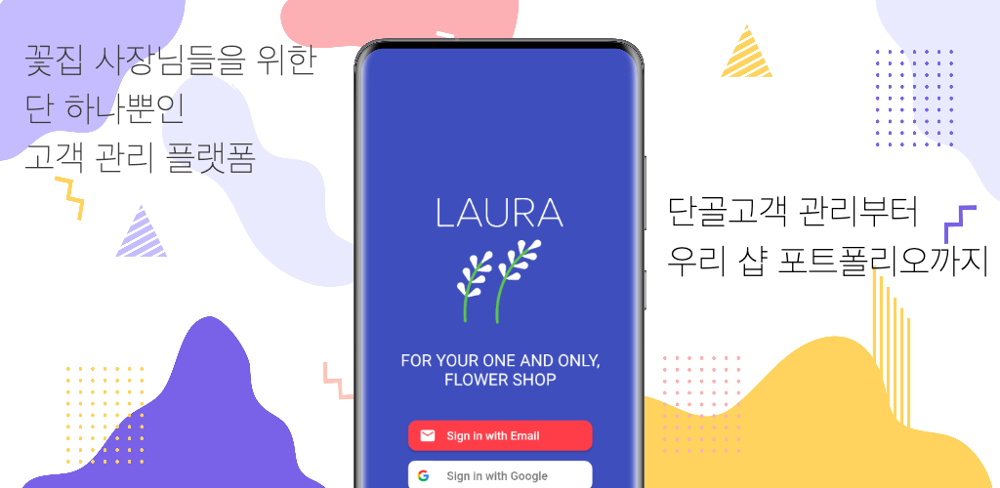
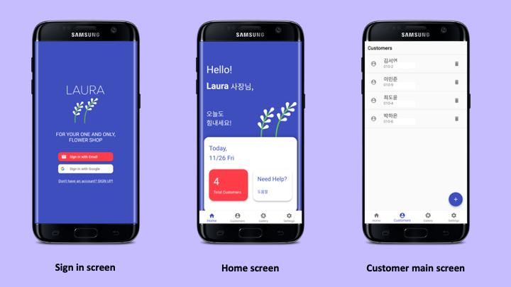
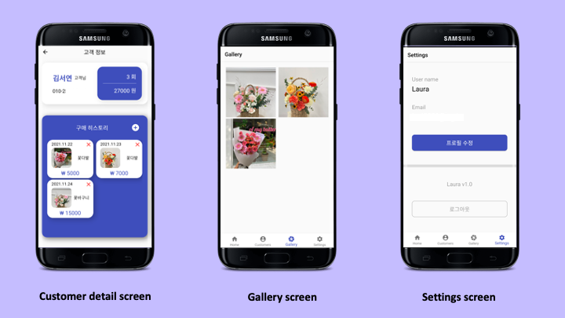

# laura-flutter-firebase-app

## About the application

전국의 꽃집 사장님들의 단 하나뿐인 화훼산업 고객관리 플랫폼, LAURA

너무나도 바쁜 꽃집 운영, 고객 관리는 “로라”가 대신해드릴게요!
전국 꽃집 사장님들을 위한 애플리케이션, 로라는 “전국 꽃집 사장님들의 단 하나뿐인 고객 관리 플랫폼”입니다. 로라 앱을 통해 다양한 꽃집 맞춤 고객 관리 서비스를 만나보세요.

► 일별 고객 방문 / 판매 수 집계
- 일별 방문자 수, 판매 금액을 한눈에 볼 수 있습니다. 매일매일 방문하는 잠재 단골 고객님들을 관리하여, 우리 숍 단골 고객님들을 만들어보세요.

► 고객별 구매 히스토리 관리
- 고객별 구매해가신 상품을 누적 관리할 수 있습니다. 간단한 사진, 메모를 통해 재방문 시 고객별 취향을 완벽 파악하여 단골 고객님의 재방문율을 높여보세요.

► 우리 플라워샵만의 포트폴리오 관리
- 우리 가게에서 판매한 상품 사진을 한눈에 볼 수 있습니다. 크기나 색감을 고르기 어려워하시는 고객님께, 우리 숍만의 포트폴리오를 보여드려 고객 만족도를 높여보세요.

### Screenshots:

### App in action: 

### Google play download
https://play.google.com/store/apps/details?id=com.laura.flower

## Project structure

### Flutter app
- project structure: https://www.geeksforgeeks.org/flutter-file-structure/
- flutter samples: https://flutter.github.io/samples/#

### Features
- Home
  - Authentication
- Customers
- Gallery
- Settings
